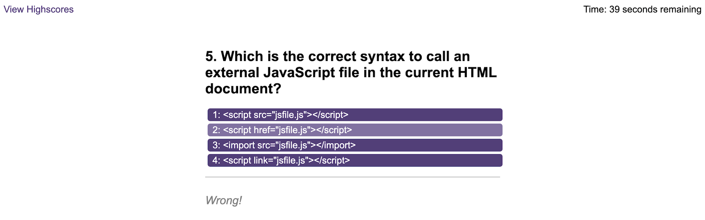

# Coding Quiz

This quiz displays 10 questions, each with 4 answer options and the user has 100 seconds to complete the quiz. If the user clicks on the right option, text below the options will display "Correct!", if not, it will say "Wrong!".

If the user clicks on the wrong option, 10 seconds is deducted from the overall time. If the user answers too many questions incorrectly, the score will go to zero and the game will end early.

Once the game is complete, regardless of the user's score, they will have the option to save their initials along with their score.

The user will then be directed to a highscores page, where the top ten scores will be displayed in descending order (highest to lowest). If the user's score is high enough, they will be able to see their score and initials displayed. Otherwise, they will need to play again and get a higher score.

All scores are saved to the user's local storage. If they no longer want to see their saved scores, they can choose to clear it, by clicking "Clear Highscores". This will delete all saved data from their local storage.

## Application Appearance

View quiz [here](https://leannecodes.github.io/coding-quiz/index.html)

## Notes
For this project I have kept my console logs in, so that I could see if I was retrieving the correct data. 

## Credit
- JavaScript questions and answers from [here](https://www.includehelp.com/mcq/javascript-multiple-choice-questions-mcqs.aspx#google_vignette)
- JavaScript Mastery on YouTube for the tip on using a current question index to help iterate through a quiz
- MDN docs for the syntax to convert an array into and object and vice versa
- MDN docs for the sort function syntax to help with highscores displaying in descending order
- W3Schools for the slice syntax, so that only the top 10 highscores are shown
